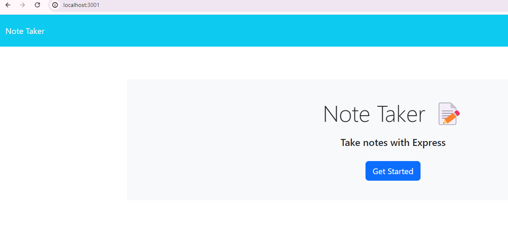
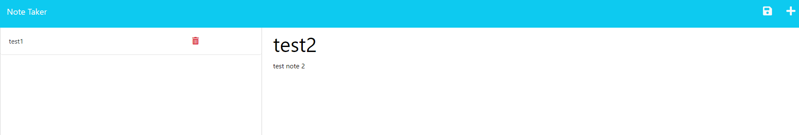
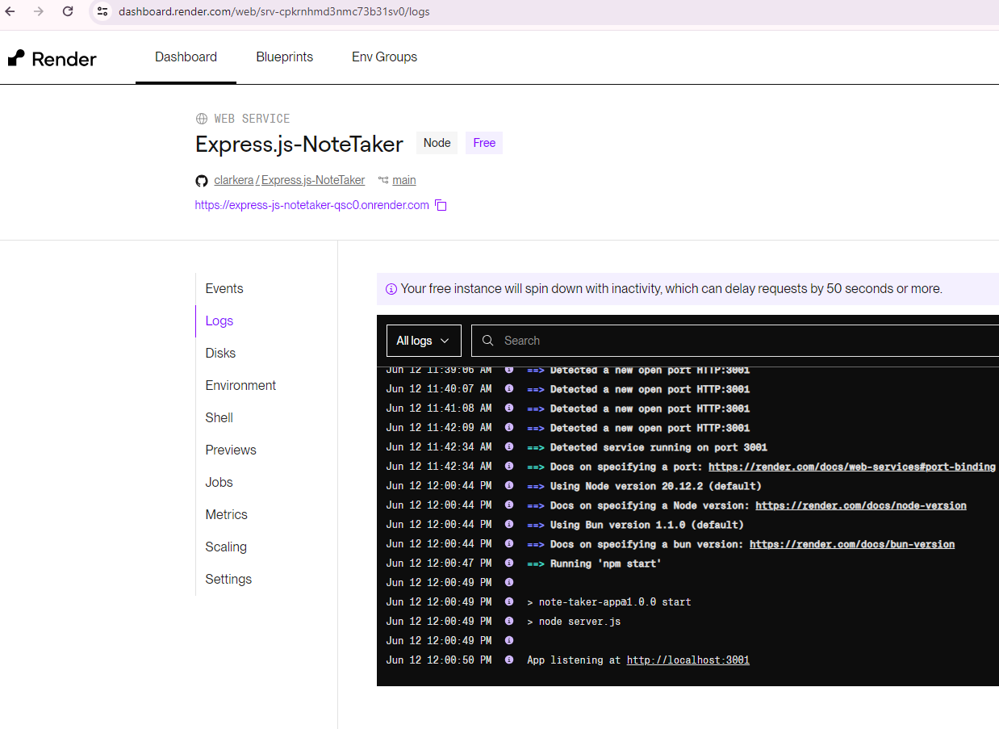

# Express.js-NoteTaker 

## Description

This assignment uses node and express.js to create a web browser-based note taking app. This app can be used by business owners who need to create tasks for employees to complete, or by a person who simply needs to take notes to stay on track! Name the note,write the note,and then click the "save" icon to make it official. Feel free to click the "delete" icon next to the note added once task is completed. 

## Link 

http://localhost:3001 

https://express-js-notetaker-qsc0.onrender.com 

## Screenshots 

